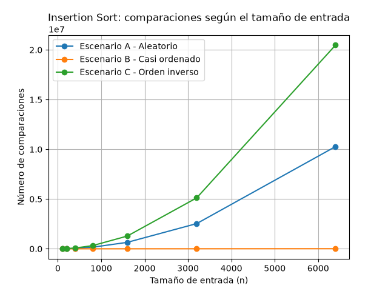
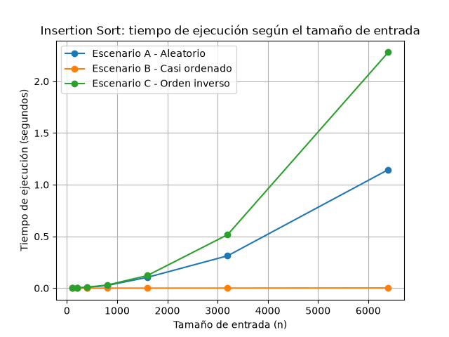
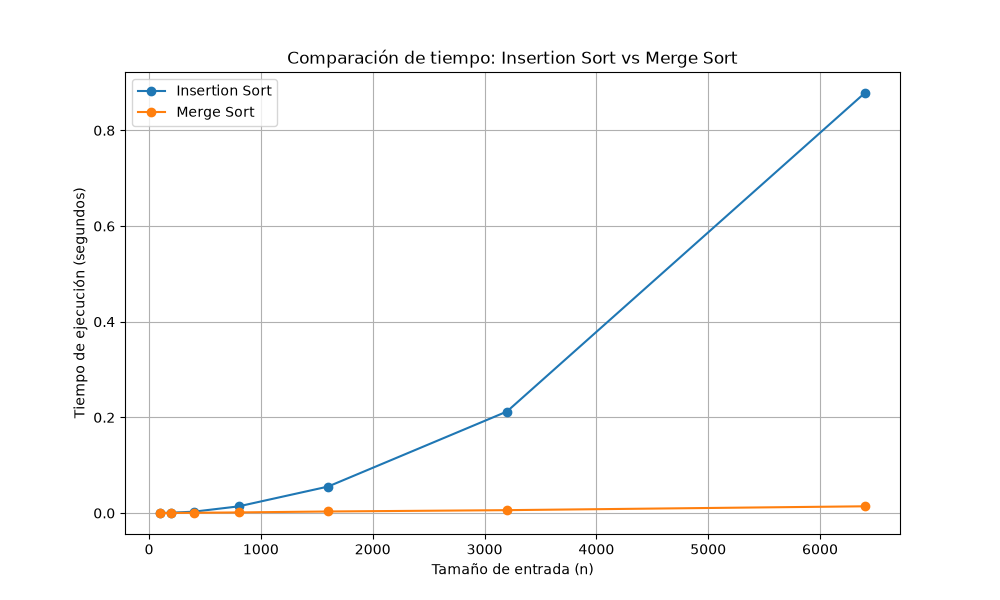

# Laboratorio evaluativo 01 — Fundamentos, complejidad y recurrencias
### **Nombre:** Alejandra Madrid Calderón

## Instrucciones para reproducir el experimento

### Requisitos

Para ejecutar los experimentos se requiere Python 3 y la biblioteca `matplotlib`.

El proyecto utiliza un entorno virtual para instalar y ejecutar las dependencias del laboratorio.

### Activar el entorno virtual

Desde la carpeta raíz del repositorio:

```bash
venv\Scripts\activate 

#Instalar las dependencias
pip install -r requirements.txt

#Ejecutar la Parte 3
python laboratorios/lab1-fundamentos-complejidad-recurrencias/parte3_casos.py

#Ejecutar la Parte 4
python laboratorios/lab1-fundamentos-complejidad-recurrencias/parte4_complejidad.py
```


## Parte 1 — Analizar el algoritmo antes de comprar hardware
**Pregunta:** La Secretaría está por firmar la compra de un servidor del doble de velocidad para que el proceso de Tamiza quepa en la ventana de cuatro horas. ¿Por qué debe analizarse primero el algoritmo, si el que está en producción lleva ocho años entregando el resultado correcto?

**Respuesta:** Antes de comprar un servidor, primero se debe garantizar un buen análisis del algoritmo implementado, ya que un problema de tiempo de ejecución no necesariamente se soluciona aumentando la capacidad del hardware. En este caso,  se utiliza el insertion sort que es capaz de procesar correctamente la lista ordenada, pero la cantidad de información ha aumentado durante los ocho años de funcionamiento del sistema y por eso este algoritmo que antes podía cumplir con las necesidades requeridas ahora tiene dificultades para procesar 1.200.000 de registros dentro de las de cuatro horas de tiempo requeridas, no es que no funcione, pero ya no cumple con la necesidad. 

Al duplicar la capacidad del servidor podría disminuirse el tiempo,  pero esto no cambia la forma en que el algoritmo ordena la lista cuando la cantidad de registros crece. Por ejemplo, esto mismo podría pasar en una base de datos universitaria con millones de registros de estudiantes, si se requiere consultar alguna información y el sistema se demora varios minutos cuando debería ser en pocos segundos entonces el algoritmo sería correcto pero no cumpliría la restricción de tiempo establecida para el sistema. 

## Parte 2 — Responsabilidad ambiental y ética de la implementación
**Pregunta:** Como responsable técnico de Tamiza, ¿qué responsabilidad ambiental y ética asume al decidir qué algoritmo de ordenamiento se ejecuta cada madrugada sobre los datos de 1.200.000 pacientes?

**Respuesta:** Es claro que como responsable técnico se asume una gran responsabilidad no solo para garantizar que el sistema funcione sino también en temas ambientales y éticos debido al impacto sobre los recursos tecnológicos y sobre las personas que son priorizadas o no según el sistema. 

En el aspecto ambiental, un proceso que se demora más consume mucho más recursos, lo que genera también un mayor consumo de energía y se vuelve una cifra significativa con el tiempo ya que son procesos que se repiten diariamente. Desde lo ético, la responsabilidad es aún mayor por tratarse de personas con condiciones de salud que exigen una atención prioritaria, por lo tanto si el sistema de ordenamiento falla o no se completa en el tiempo requerido el principal afectado por esta situación es el paciente, debido al posible retraso en su proceso de atención. Además la secretaría y el equipo encargado del sistema también tendrían que asumir consecuencias operativas y técnicas por no disponer de la lista completa.

## Parte 3 — Peor caso, mejor caso y caso promedio, demostrados en Python

### 3.1 — Explicación
El peor caso ocurre cuando la lista viene en el orden contrario al que se necesita y por lo tanto debe hacer una mayor cantidad de comparaciones, el mejor caso es cuando la lista ya viene casi ordenada  y solo se aplica un mínimo de comparaciones, mientras que el caso promedio se da cuando viene en un orden al azar.

Para decidir si el algoritmo se puede pasar a producción se debe utilizar el peor caso, ya que este me permite conocer si el sistema podría cumplir con el máximo de tiempo definido de 4 horas en el caso menos favorable, debido a que esta implementación ejecuta el caso donde tiene que hacer la mayor cantidad de comparaciones, lo cual garantiza el límite máximo de  tiempo que tardaria el proceso con cualquier entrada distinta.
 
**Escenario A:** representa el caso promedio porque el orden viene aleatorio.

**Escenario B:** es el mejor caso,  ya que al tener el 98 % en orden casi no hará desplazamientos.

**Escenario C:** es el peor caso, ya que viene de menor a mayor y debe mover cada elemento hasta el principio.

### 3.2 — Demostración experimental

**Gráfica de comparaciones**



**Gráfica de tiempo**



Los resultados de las gráficas confirman la predicción realizada anteriormente, según el tiempo de ejecucion y el número de comparaciones, donde B es el mejor caso, C el peor caso y A es el caso intermedio.

## Parte 4 — Complejidad de merge sort e insertion sort: cálculo y validación

### 4.1 — Cálculo teórico

### Merge Sort

Merge Sort divide la lista en dos partes, ordena cada una recursivamente y luego combina las dos partes ordenadas.

La recurrencia es:

$$
T(n)=2T\left(\frac{n}{2}\right)+\Theta(n)
$$

Donde:

* $2$: se generan **2 subproblemas**.
* $n/2$: cada subproblema tiene la mitad de los elementos.
* $\Theta(n)$: combinar las dos mitades requiere recorrer sus elementos.

Por tanto:

$$
a=2,\qquad b=2,\qquad f(n)=\Theta(n)
$$

#### Método maestro

La forma general es:

$$
T(n)=aT\left(\frac{n}{b}\right)+f(n)
$$

Calculamos:

$$
n^{\log_b a}=n^{\log_2 2}
$$

$$
n^{\log_2 2}=n^1=n
$$

Comparamos con $f(n)$:

$$
f(n)=\Theta(n)
$$

Por lo tanto:

$$
f(n)=\Theta\left(n^{\log_b a}\right)
$$

Se cumple el **caso 2 del método maestro**, con $k=0$:

$$
f(n)=\Theta\left(n^{\log_b a}\log^0n\right)
$$

El resultado del caso 2 es:

$$
T(n)=\Theta\left(n^{\log_ba}\log^{0+1}n\right)
$$

Sustituyendo:

$$
T(n)=\Theta\left(n^1\log n\right)
$$

$$
T(n)=\Theta(n\log n)
$$

**Cota final:**

$$
\boxed{\Theta(n\log n)}
$$

---

### Insertion Sort

Para realizar el conteo se considera la siguiente implementación. Los comentarios indican cuántas veces puede ejecutarse cada línea en el **peor caso**:

```python
def insertion_sort(datos: list[int]) -> list[int]:
    resultado = datos.copy()       # 1 vez (costo lineal por la copia)

    for i in range(1, len(resultado)):  # n - 1 iteraciones
        clave = resultado[i]            # n - 1 veces
        j = i - 1                       # n - 1 veces

        while j >= 0 and resultado[j] > clave:  # Σ(i) + (n - 1)
            resultado[j + 1] = resultado[j]     # Σ(i)
            j -= 1                              # Σ(i)

        resultado[j + 1] = clave       # n - 1 veces

    return resultado                   # 1 vez
```

En el peor caso, la lista está ordenada de forma inversa. Para cada posición $i$, el `while` puede desplazarse $i$ veces.

Por tanto, el número total de ejecuciones del cuerpo del `while` es:

$$
1+2+3+\cdots+(n-1)
$$

Aplicando la fórmula de la suma:

$$
\sum_{i=1}^{n-1}i
=
\frac{n(n-1)}{2}
$$

Por lo tanto:

* La línea de desplazamiento se ejecuta $\frac{n(n-1)}{2}$ veces.
* La línea `j -= 1` se ejecuta $\frac{n(n-1)}{2}$ veces.
* La condición del `while` se comprueba una vez adicional por cada iteración del `for`:

$$
\frac{n(n-1)}{2}+(n-1)
$$

Los demás costos son lineales:

$$
T(n)=
c_1n+
c_2(n-1)+
c_3(n-1)+
c_4(n-1)+
c_5\left(\frac{n(n-1)}{2}+n-1\right)
$$

$$
+c_6\frac{n(n-1)}{2}
+c_7\frac{n(n-1)}{2}
+c_8(n-1)+c_9
$$

Los términos dominantes son cuadráticos:

$$
\frac{n(n-1)}{2}=\frac{n^2-n}{2}
$$

Por lo tanto:

$$
T(n)=\Theta(n^2)
$$

**Cota final del peor caso:**

$$
\boxed{\Theta(n^2)}
$$

---

### Tabla de complejidades

| Algoritmo          | Mejor caso        | Caso promedio     | Peor caso         |
| ------------------ | ----------------- | ----------------- | ----------------- |
| **Merge Sort**     | $\Theta(n\log n)$ | $\Theta(n\log n)$ | $\Theta(n\log n)$ |
| **Insertion Sort** | $\Theta(n)$       | $\Theta(n^2)$     | $\Theta(n^2)$     |

### 4.2 — Validación experimental


### Análisis de los resultados

Las mediciones muestran que Merge Sort es mucho más rápido y eficiente que Insertion Sort a medida que crece la cantidad de datos. Mientras Insertion Sort se vuelve muy lento al aumentar el número de registros, por ejemplo, pasando de menos de un segundo con 100 elementos a casi un segundo completo con 6.400, Merge Sort mantiene un tiempo casi plano, tardando solo $0.014$ segundos para los mismos 6.400 registros.

Estos datos confirman exactamente lo que se calculo en la teoría: un algoritmo cuadrático $\Theta(n^2)$ se dispara con volúmenes grandes, mientras que uno logarítmico $\Theta(n \log n)$ se mantiene estable. Aunque en listas muy pequeñas la diferencia es mínima porque Merge Sort gasta un poco de tiempo organizando sus llamadas internas, desde las pruebas iniciales Merge Sort demostró ser la mejor opción.

### 4.3 — Concepto técnico a la Secretaría de Salud

Para Tamiza se recomienda utilizar **Merge Sort** como algoritmo único de ordenamiento. Esta decisión se basa en la necesidad de mantener un comportamiento predecible cuando la cantidad de entradas puede cambiar sin aviso y no se desea mantener implementaciones diferentes para cada tipo de entrada. Aunque Insertion Sort mostró un comportamiento favorable en el escenario B de la Parte 3, su desempeño depende fuertemente de la organización inicial de los datos. En cambio, Merge Sort mantiene una complejidad de $\Theta(n\log n)$ en los casos analizados y en la medición realizada sobre el escenario A, presentó tiempos menores que Insertion Sort para todos los tamaños probados.

La medición más grande realizada fue con 6400 registros. En este caso, Insertion Sort tardó **0.878182 segundos**, mientras que Merge Sort tardó **0.014148 segundos**. La diferencia se hace mayor a medida que aumenta el tamaño de entrada, como se observa en la gráfica de la Parte 4.2 [Comparación de tiempo: Insertion sort vs Merge Sort](./graficas/parte4_tiempo.png).

Para estimar el comportamiento con los 1.200.000 registros de Tamiza se utiliza una extrapolación a partir de la medición de 6400 elementos. Para Insertion Sort se considera el crecimiento cuadrático obtenido en el análisis teórico. Por tanto, se escala el tiempo mediante la relación:

$$
T(1.200.000) \approx 0.878182
\left(\frac{1.200.000}{6400}\right)^2
$$

El resultado es aproximadamente **30.874 segundos**, equivalentes a **8,58 horas**. Esta cifra es una **estimación**, no una medición directa, y supone que el comportamiento observado se mantiene al aumentar la entrada.

Para Merge Sort se utiliza su crecimiento $\Theta(n\log n)$:

$$
T(1.200.000) \approx 0.014148
\frac{1.200.000\log_2(1.200.000)}
{6400\log_2(6400)}
$$

La estimación obtenida es de aproximadamente **4,24 segundos**. También se trata de una extrapolación y no de una ejecución real con 1.200.000 registros. Bajo este modelo, Merge Sort tendría un margen temporal ampliamente superior dentro de la ventana de cuatro horas.

Por lo tanto, la propuesta de comprar un servidor con el doble de velocidad tampoco resuelve por sí sola el problema del algoritmo actual. En la medición con 6400 elementos, Insertion Sort tardó 0.878182 segundos. Suponiendo idealmente que duplicar la velocidad del servidor redujera el tiempo a la mitad, el valor sería aproximadamente 0.439091 segundos. Aplicando la misma extrapolación cuadrática, el tiempo estimado para 1.200.000 registros sería de aproximadamente **4,29 horas**, todavía superior a la ventana disponible. Por tanto, el cambio de infraestructura no elimina el crecimiento cuadrático  que se observa.

Además del tiempo, debe considerarse la memoria. Merge Sort necesita memoria adicional para realizar las divisiones y almacenar temporalmente los elementos durante la mezcla. Este costo debe contemplarse en la infraestructura de producción, especialmente con 1.200.000 registros. A cambio, se obtiene un comportamiento menos dependiente del orden inicial de los datos y se evita mantener tres implementaciones diferentes según el canal de entrada.

Teniendo en cuenta todo lo anterior, la recomendación técnica es utilizar Merge Sort como implementación única de Tamiza y validar posteriormente su comportamiento con una carga representativa de producción antes del despliegue definitivo.
